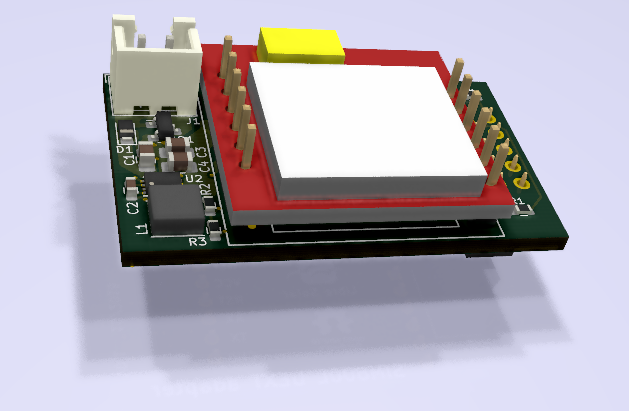
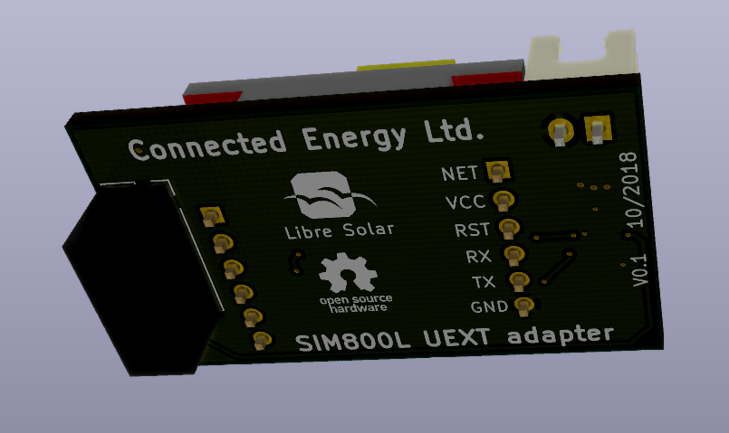

# GSM board based on SIM800L for UEXT connector

## Features

- Separate power supply from 12V or 5V (GSM board needs 4.2V and 2A)
- Reverse polarity protection for separate power supply
- UEXT connector to communicate with host MCU

### Top side 

### Bottom side

